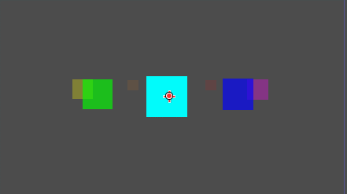
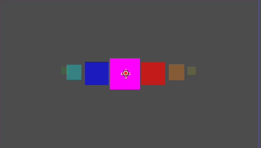
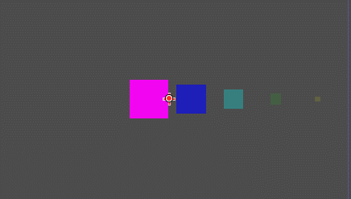
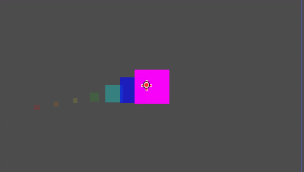
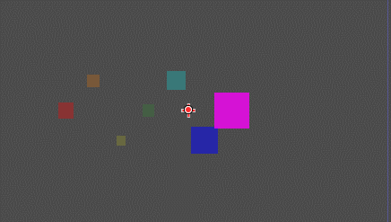
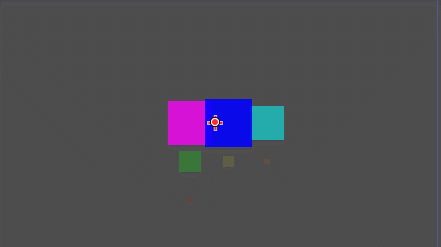
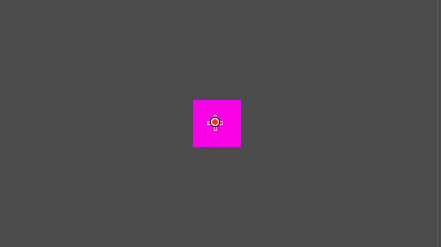
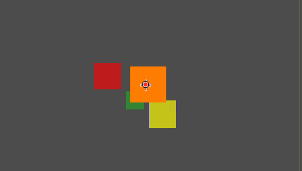

# godot-carousel-container ！out-of-the-box
This is a carousel container suitable for Godot4, which arranges controls in a special way with animated transitions
This control provides a highly flexible interface that covers a wide range of case products
# ！Please note that using this container requires raising the Z-index of the components and other controls overlaid on the container to above and above the number of rotations in order to avoid mold piercing bugs

